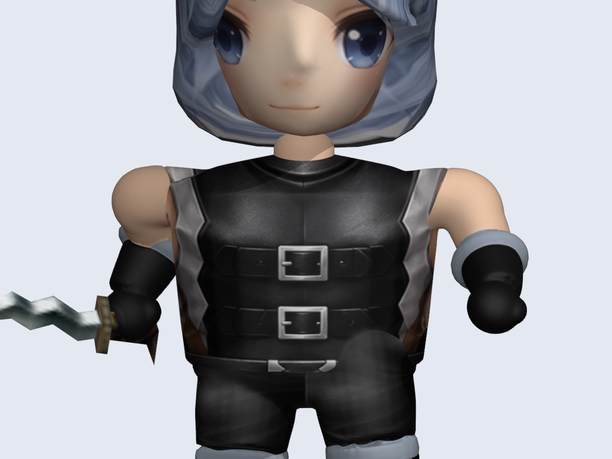
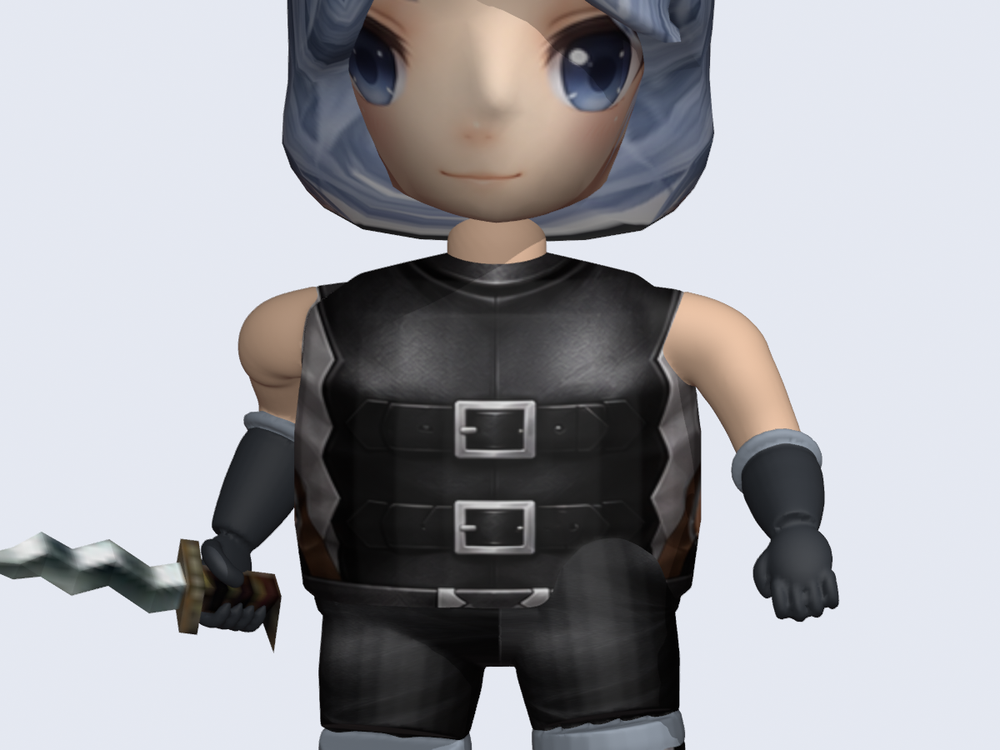

# 角色改比例与 Q 版重塑制作手册

本手册归档 2026-10-09 的 Dark Wizard Class01 → 经典矮人 → Q 版试验，包括肩臂、手掌、武器、贴图和分件接缝的返工原因。用于后续角色改型时复用方法、先定位问题，再改对应部分。它能减少重复试错，不能保证任意骨架、装备和动作一次转换完成。

**范围**：原始恢复、比例适配和 Q 版重塑是不同任务。普通恢复保留原始形状、分件、UV、Node 和动作；只有明确要求重塑时才改变拓扑。本轮只交付 Blender 实验，没有安装游戏数据，也没有得到“所有动作与最终造型均已验收”的结论。

## 目录

0. [Skill 内源码入口与阶段选择](#skill-内源码入口与阶段选择)
1. [先选方法与建立基准](#先选方法与建立基准)
2. [固定制作顺序](#固定制作顺序)
3. [骨架与动画复用](#骨架与动画复用)
4. [肩臂连接与手掌](#肩臂连接与手掌)
5. [武器挂接与握持](#武器挂接与握持)
6. [接缝、腿部与贴图](#接缝腿部与贴图)
7. [失败诊断表](#失败诊断表)
8. [本次参数与适用范围](#本次参数与适用范围)
9. [检查、交付与证据](#检查交付与证据)
10. [复用代码及工具经验](#复用代码及工具经验)

## Skill 内源码入口与阶段选择

本页是经验文档的维护入口。完整源码已经直接收入本 skill 的 scripts/chibi_experiment；下列文件是膝踝修复最终运行版本的逐字归档。肩臂版历史源码另保留在本页的 anatomy 快照压缩包中。源路径与 SHA-256 见 [源码指纹索引](chibi-experiments/source-index.json)。

这些脚本保留当时的绝对路径、对象名、Node、UV 区域和参考姿态，便于回溯已经运行过的实现。它们不是通用转换器，也不是可原地执行的新入口：build_connected.py 会向其写死的历史 OUT 写文件，inspect_saved.py 会写报告和预览。**复用时将相关模块复制到全新实验目录，先改输入、输出及所有依赖，再运行；不要直接对归档目录或历史成果运行原入口。** 本次收录不重新执行建模或覆盖实验成果。

| 需要复用的修复 | 直接读这段源码 | 使用条件 |
| --- | --- | --- |
| 肩、肘、腕比例 | [arm_anatomy.py](../scripts/chibi_experiment/arm_anatomy.py) 的 revise_arm_rest | 仅在需要这一轮比例调整时使用；最后膝踝版输入已完成此步骤，不应再次调用 |
| 掌长/宽/厚、四指、拇指、持剑与空手 | [arm_anatomy.py](../scripts/chibi_experiment/arm_anatomy.py) 的 oriented_volume、holding_hand、relaxed_hand | 先确认左右手节点、掌面坐标与实际柄轴；本例空手方向是参考空间中的固定方向 |
| 肩根、肩帽、身体融合和分件接缝 | [connected_body.py](../scripts/chibi_experiment/connected_body.py) 的 anatomical_arms、rebuild_body、split_slots | 需要同一参考空间、已确认的槽位、UV 和材质角色；共用边界坐标、权重和法线 |
| 膝踝缺口、靴筒悬空 | [continuous_legs.py](../scripts/chibi_experiment/continuous_legs.py) 的 continuous_leg、soften_ankle_envelopes | 使用髋→膝→踝→鞋内点连续扫掠；关节位置不再分别封端 |
| 扫掠辅助 | [surface.py](../scripts/chibi_experiment/surface.py) 的 Surface.sweep | 旧 add_hand 和单轴 ellipsoid 不是最新手掌方案，不能重新拿来替代三轴掌体积 |
| 实验组装、姿态对照、另存 | [build_connected.py](../scripts/chibi_experiment/build_connected.py) | 调整 ROOT/OUT/INPUT、固定源 Player BMD 路径、模块路径、对象与材质名；预先准备 textures 和 previews |
| 正/侧灰模与贴图检查 | [joint_views.py](../scripts/chibi_experiment/joint_views.py) | 按目标尺寸重设镜头及 OUT；本例固定以角色位于 x=75 的骨架为基准 |
| 保存后接缝与抽样姿态 | [inspect_saved.py](../scripts/chibi_experiment/inspect_saved.py) | 按新目录更新 OUT 和模块路径；需要 mu_connected_source_vertex 元数据，且会写报告/预览 |

### 按输入阶段选择，避免重复变形

| 当前输入 | 从已有实现复用什么 | 不应做什么 |
| --- | --- | --- |
| 原始模型或新职业 | 先走角色恢复与比例适配流程，建立新模型节点、区域与单位映射 | 不直接套 Class01 的固定坐标/节点，也不把 Q 版 profile 当作原始人体最终倍率 |
| 已融合但肩臂/手不自然的 Q 版 | 参考 anatomy 历史快照的肩臂静置调整，以及最新 arm_anatomy / connected_body | 不继续堆球体堵缝，不盲目对整件 Armor 使用躯干缩放 |
| 已完成肩臂调整，膝踝仍像断开 | 使用当前 joints 实现；在现有骨架上改下肢连续体积 | 不再次执行 revise_arm_rest，不靠“一个连通分量”宣布轮廓正确 |
| 已完成末轮膝踝修复 | 复制成果作为新的局部编辑基准，按新反馈修改相关部分 | 不从头叠加此前所有比例倍率，不默认这次全部动作已验收 |

### 当前膝踝版的实际检查范围

报告与文件身份见 [膝踝修复证据](chibi-experiments/chibi-joints-20261009/evidence.json)：5 个身体分件、60 骨、284 动作；合并身体 98790 个源顶点；重复面、开口边、非流形边均为 0；942 个共享边界副本的静置位置和权重误差为 0。动作 4/key 0、17/key 3、26/key 3、39/key 4 的求值后世界坐标边界误差为 0；行走与挥剑另有局部灰模/贴图预览。

这里的运行/奔跑动作 26 是接缝数值抽样，不能写成全动作视觉检查。脚踝饱满程度仍需看灰模侧面与低角度图；没有针对所有自相交、连续时间插值和游戏导出完成验证。此前肩臂版表格中的 100918 顶点、938 边界副本属于此前成果，应按各自证据阅读。

## 先选方法与建立基准

| 目标 | 方法 | 需要接受或处理的结果 |
| --- | --- | --- |
| 整体变大、变小 | 整体等比缩放角色与附件 | 局部比例不变；地面、移动速度另核对 |
| 最后渲染时拉矮、拉胖 | 对已经组合的角色和武器施加同一个非等比变换 | 挂接点仍能对齐；武器和身体一起变形。法线需正确变换，碰撞与逻辑范围未必随之变化 |
| 短腿、短臂、厚躯干，武器保持形状 | 改骨架局部位移，同时改网格，复用旋转动作 | 脚接地、握持、双手接触可能需要补偿 |
| 大头、可爱脸、自然肩臂的 Q 版 | 在比例适配后重塑轮廓、手掌和服装表面，调整 UV/贴图 | 只缩放不能生成新的解剖与服装结构；新拓扑需重新绑定 |

最后渲染缩放若涵盖同一组合内的身体、武器和挂点，不会单独把它们拆开。本例选择骨架和网格适配，是为了分别控制肢体比例及武器形状。

开始前记录：资源路径与 SHA-256、目标职业/装备槽位、长度单位与朝向、骨骼层级和源 Node、参考动作/关键帧、材质/图像/UV、武器姿态、输入 Blend。新结果使用独立工作区；每一轮从确定的基准重建，避免在已变形结果上重复乘倍率。

不要仅凭对象名判断身体区域。本例 ArmorClass01 同时包含躯干、肩部和部分上臂；GloveClass01 包含部分上臂、前臂、手掌、手指。把整个 Armor 当作躯干缩放曾造成手臂错形。

## 固定制作顺序

| 阶段 | 本阶段产物 | 进入下一阶段前看什么 |
| --- | --- | --- |
| 原始恢复 | 原比例角色、正确武器、原始截图 | 槽位、UV、姿态和武器本身正确 |
| 设计参考 | 用原始截图生成 Q 版概念图，保存提示词和来源 | 头身比、肩宽、上/前臂、手掌、腿与鞋的相互关系；保留角色识别特征 |
| 低成本造型 | 灰模或简单材质的正面、侧面、三分之四视图 | 肩线连续、腋窝成立、肘腕有层次、手掌大小合理；先解决轮廓 |
| 骨架与绑定 | 目标比例骨架、身体、刚体武器 | 使用同一参考空间；肩肘腕运动后没有分件开裂 |
| 手部接触 | 持物手与空手分别塑形 | 剑柄穿过合理握持区域；空手掌背、拇指、四指可辨 |
| 表面与贴图 | 清理内部重叠面、连续接缝、正确材质和 UV | 素材预览与最终渲染都检查；腿部颜色、黑斑不再靠灯光掩盖 |
| 抽样与保存 | 原始角色同场对比、动作抽样、可重开 Blend | 记录实际检查范围、源文件不变、纹理打包、代码与参数归档 |

概念图用于确定设计方向，不是三维拓扑或 UV 展开图。不要把人物概念图直接当作 UV atlas。脸部、发型、服装花纹的图像生成需另外针对纹理布局给参考图和要求。

每次修改写清“观察到的问题 → 原因假设 → 改哪些参数 → 用哪个视角判定”。同一症状连续出现时，转查骨架、空间或结构，不再只增加球体、放大圆柱或提高平滑次数。只改手臂时尽量保留已经稳定的头、腿、纹理和武器设置。

## 骨架与动画复用

### 两条适配路径不能混用

**从原始 BMD 做比例适配**：按区域改变逐帧局部平移，保留原旋转、骨骼层级、动作索引和关键帧数；同时将参考姿态网格映射到新骨架。原始动作含局部位移时也要处理，不能只改静态骨长。具体公式、接地补偿、BMD 字节修补入口见 [比例与动作复用](character-proportions-and-animation-reuse.md)。

**在已有 Blender Q 版上局部修正肩臂**：本轮保持静置旋转及现有 pose 增量曲线，改变静置矩阵平移，并重建相应网格。骨架含义相同的前提下，父子局部偏移改变了肢体长度，原动作的旋转运动继续使用。该做法没有自动重算随比例变化的全部局部动画位移，也没有更新 BMD 来源元数据。

本轮骨架坐标中，Z 向上，左右大致沿 X，修改公式为：

~~~text
shoulder' = shoulder + (-sign(shoulder.x) * inset, 0, -drop)
elbow'    = shoulder' + upper_factor * (elbow - shoulder)
wrist'    = elbow' + fore_factor * (wrist - elbow)

手骨及其全部后代位置 += wrist' - wrist
保持各骨骼静置旋转不变；对新参考骨架重建肢体网格。
~~~

手骨后代包含指骨与武器节点。只移动腕点、不移动后代，会破坏握持位置。该公式依赖当前坐标朝向，换模型后先建立其身体局部坐标系。

### 源节点映射

下表只适用于本例 Player，其他骨架应从层级、元数据和客户端槽位重建映射。

| 区域 | 右侧 Node | 左侧 Node |
| --- | --- | --- |
| 锁骨 | 25 | 34 |
| 上臂 | 26 | 35 |
| 前臂 | 27 | 36 |
| 手 | 28 | 37 |
| 指骨链 | 29–31 | 38–40 |
| 手持挂点 | 33 | 42 |
| 大腿/小腿/脚/脚趾 | 10/11/12/13 | 3/4/5/6 |

骨盆 2、脊柱 17/18、颈 19、头 20。按 mu_bmd_node 或已经核对的名字查骨骼，不能使用 Blender 骨骼集合下标代表源 Node。

### 静置姿态和坐标空间

- BMD 顶点可能是各自 Node 的局部坐标；制作表面前统一还原到目标参考姿态空间。不要在已经还原的顶点上再乘同一姿态。
- 本次新肩臂几何按目标骨架的站立静置矩阵构造；普通矮人转换工具使用的参考姿态另有定义。操作前记录 action/key，不能把两个参考空间的坐标混用。
- 本地 Blender 5.2.2 试验中，新建零长度 EditBone 时先赋 matrix、后赋 length，曾丢失预期朝向。局部修正使用“先设置非零 length，再赋完整 matrix”，并核对实际 matrix_local 与预期矩阵。此项是本次复现经验，不代表已经修复所有公共导入入口。
- 已导入模型看起来正常，不能证明骨架静置朝向正确：旧网格的局部转换可能恰好抵消了错误；新建几何会暴露问题。
- 只缩短腿不等于足底接触正确。原矮人流程有部分动作根高度补偿，不能当作 IK 或防滑步的完整实现。

## 肩臂连接与手掌

### 肩部首先是胸廓到上臂的连续过渡

球体肩帽加圆柱上臂会呈现“身体外挂两根棍子”。把球体推入身体能消除缝隙，但仍可能留下肩部圆包、肩峰过宽、腋窝错误和肘腕拥挤。

先摆肩、肘、腕的位置，再决定表面：

1. 正面确认肩峰宽度、肩线下斜程度和上臂与胸廓关系；侧面确认手臂不是直接贴在胸部前面或背后。
2. 从躯干内部开始构造肩根，沿肩帽、上臂、肘、腕形成连续曲线；截面沿途有变化，腕部明显收细。
3. 保留腋窝凹入和胸廓体积。只靠平滑会抹掉结构，不会自动生成合理腋窝。
4. 肩根过低容易形成弯钩；起点过高或端盖露在躯干外，会形成上翘肩带或凹口。把起始截面埋入躯干，再调整肩帽位置。
5. 同时看两侧。原始姿态左右肘的前后位置不同，不能以正面投影长度直接判定一侧短了，也不能只镜像世界坐标完成两只手。

这次末轮把肩根放在肩关节向内 14 单位的位置，肩帽向内 0.8、向下 3 单位，解决了前两轮肩顶凸片。数值只适用于本例；应迁移“起始截面埋入躯干、肩线向外自然下降”的关系。

### 手掌不能用球体替代

可爱的手仍需掌长、掌宽、掌厚三个不同维度，以及腕部、掌背、拇指根和四指的层次。先建立手的局部正交坐标系，再造型；不要用全局 Y 作为所有姿态的掌面方向。

- 持剑手：读取实际剑柄与挂点的相对位置；掌部贴近握柄，四指沿柄轴排列并绕横截面弯曲，拇指从另一侧覆盖。剑的变换正确后，改手去握住它。
- 空手：手腕自然延伸到稍下垂的掌面，四指长短不同且微曲，拇指在身体内侧；正面和侧面均能看出厚度。
- 黑色手套也需可读明暗。本例纯黑材质掩盖了手指结构，最终用炭灰材质提高可辨度。
- 本例新手指全部绑定相应手骨，未制作独立手指动画。需要张手、握拳切换时，要另外绑定指骨与制作/复用相应姿态。

旧 Surface.ellipsoid 只使用第一个轴并通过 sweep 构造截面，传入另外两条掌轴并不会产生预期朝向。最后使用真正的三轴体积公式：

~~~text
p = center
  + axis_length * radius_length * cos(theta)
  + sin(theta) * (axis_width * radius_width * cos(phi)
                + axis_thickness * radius_thickness * sin(phi))
~~~

曲线手指用多个控制点形成弯曲路径，并缩小端部半径。手掌朝向、指根位置和拇指侧别应先检查，再提高网格分辨率。

## 武器挂接与握持

完整客户端调用路径、矩阵和原修复证据见 [武器挂接档案](weapon-attachment.md)。后续复用保留以下要点：

- 普通 Player 手持使用 Link=false，本例右手 Node 33；(70°,0°,90°) 与相关位移属于另一分支，不能套到普通手持。
- 武器先求自身动作 0/key 0 的骨骼姿态，再挂到玩家插槽；如果已经预烘焙，就不能再做一次同样的物品姿态变换。
- 本例 Empty 的 Copy Transforms 指向对应骨骼，双方 WORLD 空间、head_tail=0；武器 parent inverse 为单位矩阵，局部矩阵仅含独立等比缩放。
- 本例 Q 版剑倍率 0.64。身体的非等比造型不再作用到剑身。
- 校验应有源数据/客户端公式的独立依据。只验证“对象矩阵等于脚本设置的矩阵”，会把错误设定也验证为正确。
- 刚体挂接、剑柄接触和双手配合是三件事。挂点正确不代表新手掌已经握住柄，也不保证两手武器自动适配。

剑柄轴应从当前物品自身姿态后的几何求得。本例它大致沿挂点局部 Y，四指沿该方向排列；其他武器不能照搬这个轴向。

## 接缝、腿部与贴图

### 连续表面与独立分件

本例为重塑试验，先将躯干、手臂和下肢的构造体融合为一个身体外表面，去除内部重叠面，再按身体槽位拆回独立对象。头部独立保留。这个方法不替代普通原始模型恢复流程。

本次表面处理顺序：构造源体积和材质区域 → 重算法线 → 体素融合 → 局部肩部平滑 → 恢复材质区域 → 平滑材质边界 → 从源表面传递并平滑权重 → 按槽位拆分。

拆分时，共享边界的坐标、权重和法线来自同一份数据；保存统一的源顶点 ID 便于检查。如果只让静止坐标重合，动作时仍可能因不同权重开缝；坐标与权重一致但法线不同，也可能出现明暗断线。

本次使用多骨权重及保体积变形，是 Blender 美术原型。经典 BMD 顶点的单 Node 绑定不能直接等价表达任意平滑多权重，不能把预览效果当作导出后效果。

### 膝踝补充：连通并不保证连接处足够饱满

末轮肩臂版随后收到侧面截图反馈：膝部和脚踝仍像断开的零件。灰模复查确认这是体积轮廓问题，不能因“一个连通分量、没有开口边”就判定关节自然。

大腿和靴筒各自封端、在膝点相接时，两个端面角度不同，会留下楔形缺口；靴筒仅接触圆鞋顶部时，融合可能只留下很细的连接。共同顶点/权重检查能证明边界一致，不能证明连接截面和外形合格。

本次修复使用髋 → 膝 → 踝 → 鞋内点的连续扫掠，在膝和踝使用内部截面，没有这些部位的独立端盖。靴筒延伸至鞋内形成充分重合，再局部柔化鞋面过渡；银色靴口以连续表面的材质区域表达。沿路径平滑过渡大腿、小腿、脚的权重，再拆回原有身体槽位。输入已经是调整过的骨架，本轮不能再调用肩臂比例变换。

后续检查增加：侧面及低角度灰模、关节最细处相对相邻肢体的截面、弯曲后的轮廓。保持同一相机、光照及姿势做前后对照，区分真实凹槽、贴图边界和投影。不要为了修复膝踝重新更改已稳定的上身参数。

[本轮代码与结果快照](chibi-experiments/chibi-joints-20261009/recipe-source.zip) · [记录与指纹](chibi-experiments/chibi-joints-20261009/evidence.json) · [修复前侧面](chibi-experiments/chibi-joints-20261009/before.png) · [修复后侧面](chibi-experiments/chibi-joints-20261009/after.png)。完整实验文件在工作区 characters/chibi_joint_blend_20261009/Chibi_Joint_Blend_Experiment.blend；此前章节的参数和报告仍标识此前肩臂版，不与本轮结果混用。

### 腿部异常的排查顺序

1. 隐藏单个部件，定位是不是裤腿与靴筒占据同一区域、是否有重复对象或重复面。
2. 用线框与截面看内部表面。贴近、交错的表面会产生闪烁/条纹；关闭线框叠加只能排除显示干扰，不能修复实际重叠。
3. 将几何问题与颜色问题分开。检查材质是否连接图像，UV 是否整片落在同一点，裤子是否误采到皮肤/头发区域。
4. 对裤腿、靴筒划定清晰边界，删除隐藏内部面或融合外壳；再布置连续 UV。不要靠无限放大鞋或拉开部件遮盖问题。
5. 在旋转视角、动作变形和保存后重开时复查。

本例旧裤子生成了整段小腿体积，靴子又生成一次，造成重叠；同时腿部材质缺图像或使用常量 UV，导致平黑/灰。最后两类问题分别处理。

### 贴图与渲染

- BMD UV 到 Blender 使用 (U, 1-V)，图像保持正常朝向；不要再翻一次图片。
- 生成新 atlas 时保留眼睛、头发、皮肤和服装各 UV 岛的功能位置；生成结果还需在模型上核对，不能只看平面图。
- 大头比例会放大原本不明显的眼鼻、发际和面部 UV 缺陷；先按参考调整，再做细节。
- 用同一镜头、灯光与色彩配置比较新旧；同时检查用户实际使用的视口模式。纯黑和过强阴影会掩盖几何。
- 保存前打包使用中的纹理。本次 Q 版图像是 1254×1254，美术实验可用；客户端贴图尺寸约束需另外处理，不能把此图直接视为可安装资源。

## 失败诊断表

| 症状/走过的弯路 | 本次原因或高优先级检查 | 后续处理 |
| --- | --- | --- |
| 上臂像外挂棍子 | 肩峰过宽、短前臂加粗护腕、球帽和胸廓关系错误 | 先调整关节点与长度，再重塑肩根和截面 |
| 无缝了仍不自然 | 只解决表面相交，没有解决比例与轮廓 | 正/侧灰模看肩线、腋窝、肘腕及掌形 |
| 肩膀像两个球 | 肩帽过圆、根部路径不顺、上臂没有渐变 | 肩根埋入胸廓，收肩并下调肩帽，连续扫掠 |
| 肩顶凸片或凹口 | 扫掠起点/端盖露出、根部过高 | 修正起点与包络；多平滑不能替代这个步骤 |
| 手像黑球 | 只生成椭球，厚度过大，无指列与拇指关系 | 三轴掌部、四指曲线、独立拇指，改善材质明暗 |
| 空手从正面像薄钩 | 掌面朝向不合适，视角只见掌边 | 同时调整掌厚与下垂方向，检查三视图 |
| 原 Armor 适配后手臂变形 | 整个对象使用躯干缩放，忽略上臂 Node | 按实际区域与节点变换，保留连续边界 |
| 恢复原生上身后宽肩、细腰、腰部悬空 | 旧坐标转换和区域倍率仍不适配目标结构 | 先校对参考空间与绑定；本次该路线未成功，不当作完成方案 |
| 原网格正常，新建几何扭曲 | 静置矩阵轴向问题被旧转换抵消 | 检查 EditBone 创建顺序和矩阵，不盲改新网格旋转 |
| 裤腿闪纹同时颜色不对 | 重叠体积和 UV/材质问题共存 | 分开验证几何与采样 |
| 数值检查通过，剑方向仍错 | 检查复述了错误挂接参数 | 对照客户端正确分支和源物品姿态 |
| 站立正常，弯肘开裂 | 分件边界绑定或法线不一致 | 从同一表面复制边界坐标、权重与法线 |
| 换模型照抄脚本后失败 | 绝对路径、Node、坐标轴、尺度、UV 区域和动作假设未替换 | 先填写新模型映射与尺寸基准；不从旧输出重复叠加变换 |

## 本次参数与适用范围

这是复现用记录，不是所有模型的标准比例。早期 Q 版 profile 作用在已适配的经典矮人数据上；不能把它当作直接作用于原人的最终倍率。完整 profile 随快照保存。

| 参数组 | 实際取值/含义 |
| --- | --- |
| 早期 Q 版 profile | leg 0.62、arm 0.58、torso 0.76、width 0.70、depth 1.05、head 2.10、hand 0.62、foot 1.12、weapon 0.64 |
| 末轮骨架修正 | 每肩向内 3.5、下移 2；相对上一版上臂 ×1.15、前臂 ×1.25 |
| 肩根/肩帽 | 相对新肩关节：向内 14；肩帽向内 0.8、向下 3 |
| 上臂到腕扫掠 | 控制点为根、肩帽、上臂中部、肘、腕；49 个截面，深度系数 0.86 |
| 扫掠半径插值 | t=(0,0.65,1,1.65,2.5,3,3.28,3.55,4)，r=(3.5,4.6,4.75,4.65,3.85,3.6,4.55,4.1,2.65) |
| 护腕 | 最大半径 5.1，深度系数 0.91，位于肘到腕方向约 0.55–1.9 单位 |
| 持剑掌部三轴半径 | 长 3.5、宽 3.55、厚 1.7；四指半径 0.86、间距 1.82 |
| 空手掌部三轴半径 | 长 4.1、宽 3.65、厚 1.95；四指间距 1.85，指长分别造型 |
| 表面 | voxel 0.42；整体平滑 4 次、肩部局部平滑 22 次、权重平滑 6 次 |
| 手套 | 材质 diffuse RGBA=(0.042,0.048,0.058,1)，roughness=0.62 |

换尺度时先选目标身高或某个可靠骨段为尺度基准，将长度、半径、体素大小、平滑距离等量纲参数一并换算；角度、比例和拓扑次数另判断。高分辨率不能补救错误轮廓，体素过大会吞掉指间结构，过细则显著增加建模与权重计算成本。

末轮脚本顶部仍有未被当前函数使用的旧 ARM_RADII 等常量。**实际生效参数以 anatomical_arms 中的 controls/knots/sizes 和 arm_anatomy.py 为准**。冻结快照保留历史原貌；下一次适配时先统一参数入口，避免改到无效变量。

## 检查、交付与证据

### 复用时的检查清单

- 设计：正面、侧面、三分之四视图；肩线、腋窝、肘腕、掌厚、拇指侧别、腿与鞋边界。
- 动作：至少覆盖本模型需要的站立、行走、奔跑、挥砍/抬臂和最大关节弯曲；有双手/骑乘需求时增加对应接触。记录真实 action/key，不把动作数量当视觉覆盖率。
- 结构：骨架映射、引用对象、权重归一化、共享边界坐标/权重/法线；删除不应存在的内部面与重复面。
- 材质：图像、UV 区域、朝向、尺寸；视口与渲染分别检查。
- 文件：重开实际交付 Blend，确认纹理打包、原始对照可见、武器绑定、动作存在、输入哈希不变。
- 导出：只有完成新骨架/动画及绑定格式转换、回读和客户端验证后，才声明游戏可用。导入/保存成功不等于这个条件成立。

### 末轮已记录的结果

来源为 [报告与指纹快照](chibi-experiments/chibi-20261009/evidence.json)，不是本次文档整理重新运行的模型检查：

| 项目 | 记录 |
| --- | --- |
| 身体部件 / 骨骼 / 动作 | 5 / 60 / 284 |
| 身体表面合并检查（不含独立头部） | 1 个连通分量，100918 个唯一源顶点 |
| 重复面 / 开口边 / 非流形边 | 0 / 0 / 0 |
| 共享边界副本计数 | 938 |
| 共享位置 / 权重最大误差 | 0 / 0 |
| 武器 / 原始对照 | Node 33；原始对照可见 |
| 使用的文件纹理 | 3 张，均已打包 |
| 静态姿势抽样 | action 4/key 0；17/key 3；39/key 4 |
| 输入 Blend SHA-256 | 09b8c8c5007847fa91646a22cd21f5ff400ff3f989f5443de3b44902a8c944e1，处理前后相同 |

连通和无重复面的检查不证明没有所有自相交，也不评价解剖是否自然。共享法线由制作流程复制，旧检查报告没有单独给法线误差指标。末轮没有完成全部动作、连续时间插值、BMD 导出或客户端检查。

较早武器修复的六姿态/整段动作 39 数值证据属于那一版成果，不能当作末轮重塑后的完整验证。末轮手掌仍是可继续美术调整的试验成果。

### 前后对比

这两张图分别来自“已融合但手仍呈球状”的上一版和末轮肩臂重塑版，使用对应实验的肩臂前视预览。

## 复用代码及工具经验

### 文档与冻结快照

- [制作脚本、参数、提示词和报告快照](chibi-experiments/chibi-20261009/recipe-source.zip)：保存当次实际使用的 5 个脚本、profile、生成提示词、报告和工作区说明，避免清理工作区后丢失关键经验。
- [证据索引](chibi-experiments/chibi-20261009/evidence.json)：文件身份、输入与输出指纹、报告内容、参数和适用限制。
- [比例适配实现与流程](character-proportions-and-animation-reuse.md)、[武器挂接](weapon-attachment.md)、[角色恢复与纹理](character-model-assembly-and-textures.md)、[动作索引](player-action-index.md)。

快照是历史可读源码，不是通用一键转换器：保留了绝对路径、固定对象名、源 Node、参考姿态和材质角色等本例假设；运行仍需原始资源、前一版 Blend 和项目 skill 模块。没有把大型 Blend、游戏资源或纹理塞进压缩包。新模型应复用算法并重新提供输入映射；不要直接执行旧脚本覆盖旧输出。

| 脚本 | 可复用内容 | 迁移前必须改/核对 |
| --- | --- | --- |
| arm_anatomy.py | 肩肘腕静置位置调整；三轴掌体积；持剑与空手曲线手指 | 身体坐标、关节/挂点、掌轴、尺度、握柄几何；空手方向当前硬编码在参考骨架坐标中 |
| connected_body.py | 连续体积、融合、材质角色、权重传递、分件共享边界 | 身体形状、UV atlas、槽位、节点、量纲参数、实际生效变量 |
| surface.py | 扫掠与曲线辅助 | 旧 ellipsoid 不支持完整三轴朝向；不要重新采用旧球形 add_hand |
| build_connected.py | 组装、对照、渲染和保存 | ROOT/OUT/INPUT、固定源 BMD、对象/材质名、输出文件名和参数解析依赖 |
| inspect_saved.py | 按共享源 ID 检查接缝与拓扑，记录纹理/动作/挂点 | 适用的对象元数据与节点；不包含审美判断、法线误差或全面自相交检查 |

### 当前工作区成果定位

根目录为 tools/art_pipeline/workspace/characters/：

| 目录 | 作用 |
| --- | --- |
| dwarf_weapon_attachment_fixed_20261009/runs/v01 | 武器修正后的经典矮人基准 |
| chibi_dwarf_arm_fixed_20261009 | 原始截图、Q 版概念图、早期 profile 与 atlas；其旧肩臂方案不再作为最终造型 |
| chibi_connected_20261009 | 解决身体接缝、腿部重叠与 UV 的基准；手部仍不自然 |
| chibi_anatomy_20261009 | 末轮 Chibi_Anatomy_Experiment.blend、脚本、预览、报告；最终构建记录为 build_v03.log |

工作区可能被清理，所以核心方法、参数、前后图片与小型源码快照保存在本手册旁。完整重现还需要表中的资产依赖。

### Blender 操作中实际遇到的坑

- 新建/编辑骨骼前只选择目标 rig，避免编辑错骨架；保存原始对照时不要将其当作目标骨架修改。
- 视口在 MATERIAL 模式下直接指定 paint.sl 曾发生枚举不匹配；先切 SOLID，再设置 STUDIO、TEXTURE 和 studio_light。
- 应用修改器后旧 VertexGroup 对象引用可能失效；按名称重新取当前组再删除。
- 材质节点按 node.type 查找或自行保存引用，避免依赖可能本地化的显示名称。
- 导入 build_experiment 模块会触发其参数读取；当次后台运行必须在双横线后传 --experiment。迁移时应梳理这个依赖，不把“导入函数”误当无副作用。
- 原始对照在当前场景是静态参考，手动切换右侧动作不会自动同步它；生成对照预览时分别应用同一源 action/key。
- 一次后台运行失败不意味着历史日志全部无效；交付以最后成功保存、重开检查对应的文件与指纹为准，不混用早期报告。

### 下一次开工时填写

~~~text
目标角色 / 装备槽位：
只改比例，还是允许重塑拓扑：
输入资源 / 基准 Blend / SHA-256：
源骨架朝向、单位、参考 action/key：
胸廓、肩肘腕、髋膝踝、手指及武器节点映射：
源截图 / 概念图 / 提示词记录：
目标肩宽、上下臂长度、掌长宽厚、头身比：
武器自身姿态 / 握柄轴 / 挂接分支 / 独立比例：
UV atlas / 材质角色 / 纹理尺寸：
必须覆盖的动作与接触：
输出新目录 / 采用的脚本快照 / 参数差异：
本轮只解决的问题 / 判断该问题的视角：
已检查内容 / 尚未验证内容：
~~~
